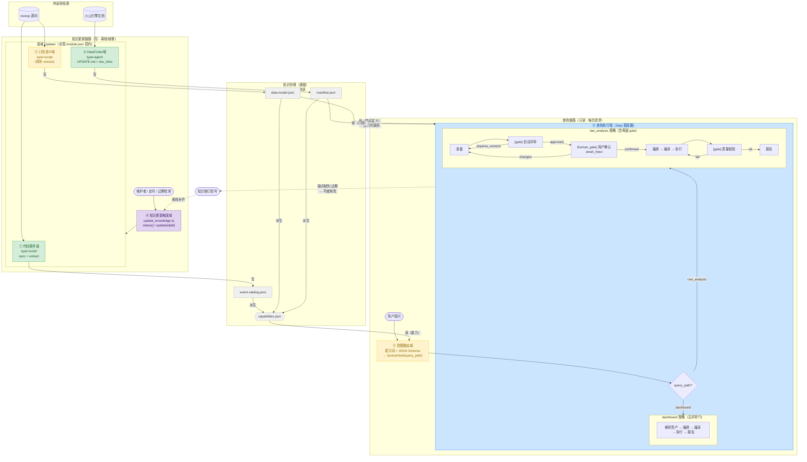

# nextop-data-analytics 架构设计

> 单一权威文档。覆盖：领域划分、目录结构（现状 + 目标）、架构图、各领域职责与文件清单。

---

## 一、核心原则

**两条链路彻底分离，通过知识存储这一层读写边界相遇。**

| | 知识更新链路 | 查询链路 |
|---|---|---|
| 触发者 | 维护者 / 定时任务 / 过期检测 | 终端用户 |
| 读写 | **写** 知识存储 | **只读** 知识存储 |
| 频率 | 偶发、按需 | 每次请求 |
| 唯一反向耦合 | ← 收「知识缺口信号」 | → 发「知识缺口信号」后优雅降级 |

**每个知识域只声明「如何更新」**（`module.json` Updater 契约），由控制平面统一触发，不自决时机。

**查询执行是声明式 Step 状态机**，gate 不通过 = 打回某步（`revise`），重试计数由调度器管；人在环 gate 挂起等输入（`await_input`）。

---

## 二、六个领域

```
三个平面 × 六个领域
┌──────────────────────────────────────────────────────────┐
│ 控制平面     ④ 知识更新触发域                             │  ← 知识更新链路
├──────────────────────────────────────────────────────────┤
│ 数据平面     ① 代码事件知识域                             │
│（知识存储）  ② DataFinder 接口域                          │  ← 接缝
│              ③ 口径语义域                                 │
├──────────────────────────────────────────────────────────┤
│ 处理平面     ⑤ 意图路由域                                 │  ← 查询链路
│              ⑥ 查询执行域                                 │
└──────────────────────────────────────────────────────────┘
```

| 领域 | 职责 | 真相源 | 闭环状态 |
|---|---|---|---|
| ① 代码事件知识域 | nextop 有哪些事件、参数、上报时机 | nextop 源码 | ✅ 已闭环 |
| ② DataFinder 接口域 | DataFinder API 端点定义 + 文档链接 + 运行时调用 | 火山引擎官方文档 | ✅ 已闭环 |
| ③ 口径语义域 | DAU 口径、身份键、nextopd 公共参数、默认指标定义 | nextopd 实现 + nextop.defaults.json | ⚠️ 半闭环（待补提取脚本） |
| ④ 知识更新触发域 | 注册各域 Updater，统一 status / update | — | 🆕 待建 |
| ⑤ 意图路由域 | NL → QueryIntent，匹配能力，决定 query_path | capabilities.json（派生自①②③） | ⚠️ 手写待派生 |
| ⑥ 查询执行域 | QueryIntent → Plan → Compile → Execute → Result；两策略，gate 可打回 | — | 🔄 生命周期闭环 |

---

## 三、目录结构

### 目标结构（Target）

```
data-analysis/
│
├── ARCHITECTURE.md                        ← 本文（单一权威）
├── .env.local                             ← 凭据，gitignored
├── .gitignore
│
├── domains/
│   │
│   ├── event-knowledge/                   # ① 代码事件知识域
│   │   ├── module.json                    # Updater 契约（type=script）
│   │   ├── sync_nextop.sh                 # git clone / pull nextop 仓库
│   │   └── extract_events.ts              # 解析源码 → event-catalog.json
│   │
│   ├── datafinder-interface/              # ② DataFinder 接口域
│   │   ├── module.json                    # Updater 契约（type=agent，含 doc_links）
│   │   ├── manifest.json                  # 端点定义（method/path/params/doc_url）
│   │   ├── client.ts                      # DataFinderClient + call() + 类型化 wrappers
│   │   ├── cli.ts                         # node build/.../cli.js list/describe/call
│   │   ├── UPDATE.md                      # agent 更新流程（WebFetch 文档 → 改 manifest）
│   │   └── index.ts
│   │
│   ├── metric-semantics/                  # ③ 口径语义域
│   │   ├── module.json                    # Updater 契约（type=script，待补）
│   │   ├── extract_data_model.ts          # 🆕 待建：从 nextop 代码提取
│   │   └── data-model-protocol.md         # 手写口径规范（过渡期）
│   │
│   ├── knowledge-update/                  # ④ 知识更新触发域（控制平面）
│   │   └── update_knowledge.ts            # 🆕 待建：status() / update(id|all)
│   │
│   ├── intent-routing/                    # ⑤ 意图路由域
│   │   ├── capabilities.json              # CapabilitySpec（目标：从①②③派生/校验）
│   │   ├── capability-inventory.md        # 能力清单说明（人读）
│   │   ├── query-intent-protocol.md       # 提示词 + 路由规则
│   │   └── query-intent.schema.json       # QueryIntent 结构约束
│   │
│   └── query-execution/                   # ⑥ 查询执行域
│       ├── scheduler/
│       │   ├── workflow.json              # 🆕 声明式 step 图 + back-edges + 重试上限
│       │   └── scheduler.ts              # 🆕 StepScheduler（状态机循环 + 持久化 + resume）
│       ├── steps/
│       │   ├── understand.ts              # S1：NL → QueryIntent（调 ⑤）
│       │   ├── route.ts                   # S2：按 query_path 分叉
│       │   ├── dashboard/                 # Path A（无评审门）
│       │   │   ├── resolve.ts             # 4A：确认 report_id / dashboard_id
│       │   │   ├── plan.ts                # 5A：QueryPlan（仅时间范围）
│       │   │   ├── compile.ts             # 6A：CompiledQuery
│       │   │   ├── execute.ts             # 7A：调用 ② DataFinder
│       │   │   └── report.ts              # 8A：输出 ExecutionResult
│       │   └── raw-analysis/              # Path B（含两道 gate）
│       │       ├── prepare.ts             # 4B–5B：加载口径 + 选数据路径
│       │       ├── auto_review.ts         # 6B：[gate] subagent 自动评审
│       │       ├── user_review.ts         # 7B：[human_gate] await_input
│       │       ├── plan.ts                # 8B：QueryPlan
│       │       ├── compile.ts             # 9B：CompiledQuery
│       │       ├── execute.ts             # 10B：调用 ② / kafka / local
│       │       ├── validate.ts            # 11B：[gate] 质量校验
│       │       └── report.ts              # 输出 ExecutionResult
│       ├── executors/
│       │   ├── kafka_executor.ts          # Kafka 原始事件采样
│       │   └── local_executor.ts          # 本地 CSV/NDJSON（DuckDB）
│       └── protocols/                     # 各步骤的 I/O 契约（schema + 协议文档）
│           ├── dashboard/
│           │   ├── query-plan-protocol.md
│           │   ├── compiled-query-protocol.md
│           │   └── execution-result-protocol.md
│           └── raw-analysis/
│               ├── query-plan-protocol.md
│               ├── query-plan.schema.json
│               ├── compiled-query-protocol.md
│               ├── compiled-query.schema.json
│               ├── execution-result-protocol.md
│               ├── execution-result.schema.json
│               ├── review-protocol.md
│               └── datafinder-kafka-raw-events.md
│
├── knowledge-store/                       # 接缝：更新链路写 / 查询链路读（均 gitignored）
│   ├── event-catalog.json                 # ← ① 产出
│   ├── data-model.json                    # ← ③ 产出（待建）
│   └── .gitkeep
│
└── outputs/                               # 运行产物（gitignored）
    └── <run_id>/
        ├── state.json                     # 调度器状态（支持挂起恢复）
        └── result.*
```

### 现状结构（Current）与迁移映射

```
现状路径                                              → 目标路径
─────────────────────────────────────────────────────────────────────
skills/nextop-data-analytics/tools/sync_nextop.sh    → domains/event-knowledge/sync_nextop.sh
skills/nextop-data-analytics/tools/extract_events.ts → domains/event-knowledge/extract_events.ts
skills/nextop-data-analytics/tools/datafinder/      → domains/datafinder-interface/
skills/nextop-data-analytics/tools/kafka_executor.ts → domains/query-execution/executors/kafka_executor.ts
skills/nextop-data-analytics/tools/local_executor.ts → domains/query-execution/executors/local_executor.ts
references/common/capabilities.json                 → domains/intent-routing/capabilities.json
references/common/query-intent-protocol.md          → domains/intent-routing/query-intent-protocol.md
references/common/query-intent.schema.json          → domains/intent-routing/query-intent.schema.json
references/common/capability-inventory.md           → domains/intent-routing/capability-inventory.md
references/common/nextop-analytics-data-model.md    → domains/metric-semantics/data-model-protocol.md
references/common/volcengine-openapi-capabilities.md → domains/datafinder-interface/（合并到 manifest + README）
references/dashboard/                               → domains/query-execution/protocols/dashboard/
references/raw_analysis/                            → domains/query-execution/protocols/raw-analysis/
references/common/nextop-event-catalog.json         → knowledge-store/event-catalog.json
```

---

## 四、架构图

### 全景（两条链路）



### ⑥ 执行调度器（Step 状态机 + 打回）

```mermaid
stateDiagram-v2
    [*] --> S1_understand

    S1_understand --> S2_route : QueryIntent

    S2_route --> A_resolve    : query_path = dashboard
    S2_route --> B_prepare    : query_path = raw_analysis

    A_resolve --> A_plan --> A_compile --> A_execute --> A_report --> [*]

    B_prepare --> B_auto_review

    B_auto_review --> B_user_review : approved
    B_auto_review --> S1_understand : requires_revision（打回，上限 2）

    B_user_review --> B_plan       : confirmed
    B_user_review --> S1_understand : changes（打回）
    B_user_review --> [*]          : cancelled → abort

    B_plan --> B_compile --> B_execute --> B_validate

    B_validate --> B_report --> [*] : quality ok
    B_validate --> B_plan           : quality fail（打回，上限 2）
```

---

## 五、Updater 契约（module.json 规范）

每个知识域放一份 `module.json`，声明自己如何更新：

```jsonc
{
  "id": "event-knowledge",
  "description": "nextop 事件目录（名称/参数/上报时机）",
  "truth_source": "nextop 源码 github.com/nextop-os/nextop",
  "serves": ["knowledge-store/event-catalog.json"],
  "update": {
    "type": "script",                        // script=自动 | agent=需 LLM 介入
    "cmd": "domains/event-knowledge/sync_nextop.sh && python3 domains/event-knowledge/extract_events.ts"
  },
  "check": {
    "type": "script",
    "cmd": "python3 domains/knowledge-update/check_freshness.ts event-knowledge"
  },
  "doc_links": []
}
```

`type` 的两个值：
- **`script`**（①③）：确定性，控制平面直接跑。
- **`agent`**（②）：需 LLM 读文档判断，控制平面输出「更新指令 + doc_links」交给 Agent 走 `UPDATE.md` 流程。

**新增知识域 = 丢一个 `module.json` 进对应目录，④ 自动发现，零改动接入。**

---

## 六、Step Outcome 契约

调度器只认这一个结构，每个 step 返回其中之一：

```
StepOutcome =
  | { kind: "advance" }                          // 通过，进下一步
  | { kind: "revise", target: StepId, patch }    // 打回到 target，patch 修订上下文
  | { kind: "await_input", prompt }              // 挂起等人工（用户确认 gate）
  | { kind: "done", result }                     // 整条链路完成
  | { kind: "abort", reason }                    // 终止失败
```

三处打回（back-edge）：

| Gate | 触发 | 打回到 | 上限 | 超限 |
|---|---|---|---|---|
| `B_auto_review` | subagent `requires_revision` | `B_prepare` | 2 | 升级人工 |
| `B_user_review` | 用户要求修改 | `B_prepare` | 用户自控 | 用户取消 → abort |
| `B_validate` | 质量不达标 | `B_plan` | 2 | 升级人工 |

---

## 七、建设路线图

> **实现语言约定（2026-06-12 更新）**：全仓库 TypeScript（用户决定全量迁移，Python 已清零）。工具经根目录 `npm run build:tools` 编译到 `build/`，以 `node build/domains/.../x.js` 调用。

| 阶段 | 内容 | 依赖 |
|---|---|---|
| **P0（现已完成）** | ① 事件知识域闭环、② DataFinder 接口域闭环 | — |
| **P1（下一步）** | 补 `module.json` × 3（①②③）；建 ④ `update_knowledge.ts` 骨架 | P0 |
| **P2** | ③ 口径语义域闭环（`extract_data_model.ts`）；目录迁移到目标结构 | P1 |
| **P3** | ⑥ 调度器骨架（`workflow.json` + `scheduler.ts`）；steps 薄封装现有协议 | P2 |
| **P4** | ⑤ `capabilities.json` 改为从①②③派生/校验（消除双份维护） | P3 |
